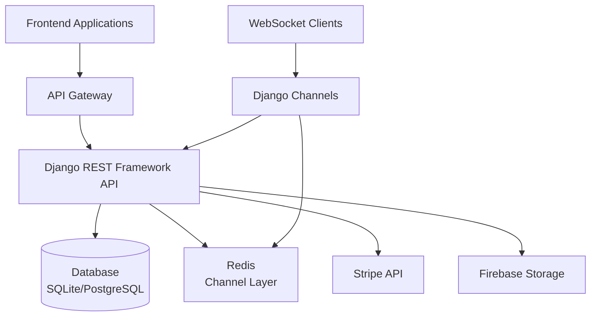
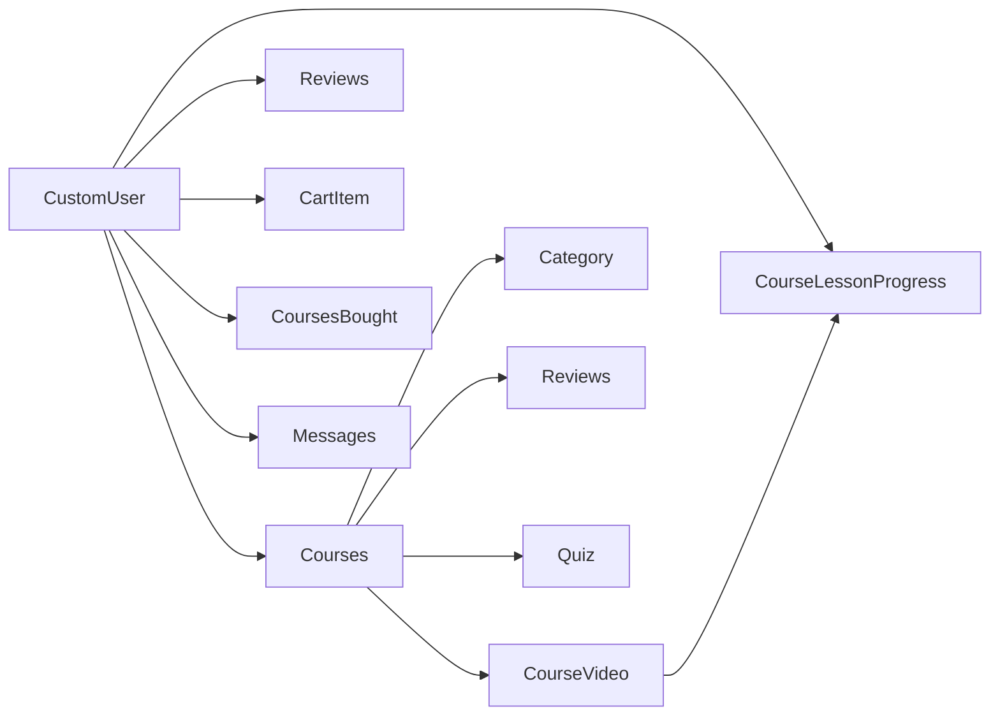
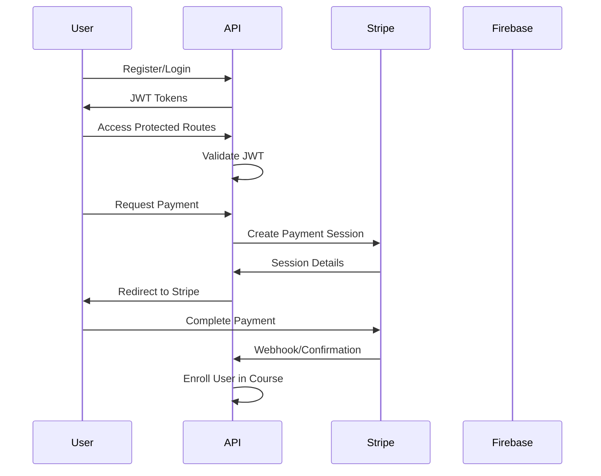
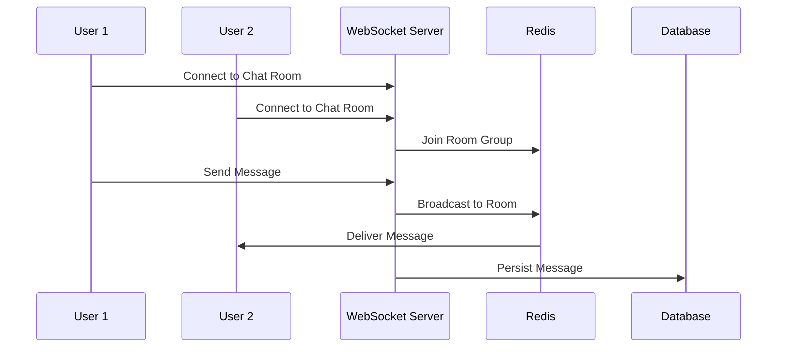
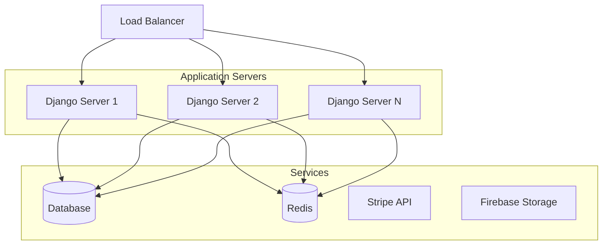

# Lernr Backend Architecture

## High-Level Architecture



## Component Details

### 1. Django Core Components

#### Main Project (lernr)
- **settings.py**: Configuration including database, authentication, middleware
- **urls.py**: Main URL routing to apps
- **asgi.py**: ASGI configuration for WebSocket support
- **routing.py**: WebSocket routing configuration
- **wsgi.py**: WSGI configuration for HTTP requests

#### Apps Structure

1. **Users App**
   - Custom user model with email-based authentication
   - JWT token management
   - Password reset functionality
   - Profile management

2. **Courses App**
   - Course creation and management
   - Video content handling
   - Progress tracking
   - Reviews and ratings
   - Shopping cart functionality

3. **Community App**
   - Real-time messaging system
   - Chat consumers for WebSocket handling

4. **Payments App**
   - Stripe integration for course purchases
   - Payment session creation

### 2. Data Layer

#### Database Models Relationships



### 3. External Services Integration

1. **Stripe API**
   - Payment processing for course purchases
   - Product and price management

2. **Firebase Storage**
   - Media file storage (course thumbnails, videos, profile images)

3. **Redis**
   - Channel layer for WebSocket communication
   - Caching (potential future use)

4. **SMTP Server**
   - Email delivery for password reset functionality

### 4. Authentication Flow



### 5. Real-time Messaging Flow



## API Layer Structure

### REST Endpoints Organization

```
/api/
├── /token/                    # Authentication
├── /user/                     # User management
├── /courses/                  # Course management
│   ├── /course/              # Courses CRUD
│   ├── /category/            # Categories CRUD
│   ├── /review/              # Reviews CRUD
│   ├── /cartItem/            # Cart management
│   ├── /bought_courses/      # Purchased courses
│   ├── /course_video/        # Course videos
│   ├── /course_lessons/      # Lesson progress
│   └── /quiz/                # Course quizzes
├── /community/               # Community features
│   └── /messages/            # Messaging
└── /payments/                # Payment processing
    ├── /stripe/              # Single course payment
    └── /stripe_cart/         # Cart payment
```

## Deployment Architecture



This architecture supports horizontal scaling with multiple Django instances sharing the same database and Redis instance for WebSocket communication.