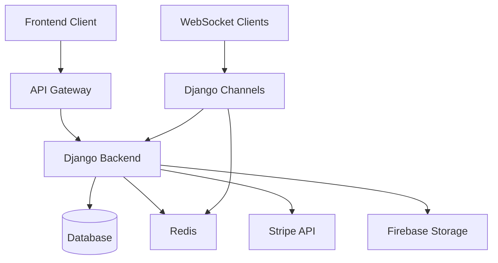

**Lerner Backend: Your Bridge to Knowledge**
This repository holds the backend engine of Lerner, your eLearning platform's nerve center. Here, robust algorithms and secure infrastructure work tirelessly to deliver a seamless and personalized learning experience.

## Documentation

For detailed information about this project, please refer to the following documentation files:

1. [Comprehensive Documentation](#comprehensive-documentation) - Complete overview of the system
2. [Architecture Details](ARCHITECTURE.md) - System architecture and component relationships
3. [Setup Guide](SETUP.md) - Step-by-step installation and configuration instructions

## What powers Lerner's backend:

Scalable architecture: Built to handle the demands of a growing user base and extensive learning content.
Secure data management: User information and learning progress are protected with industry-standard security measures.
Seamless API integration: Connects with external services to enrich the learning environment.

## For developers:

Dive into the codebase to explore the technologies powering Lerner's backend intelligence.
Feel free to contribute with pull requests and suggestions to help shape the future of Lerner's engine.
Get ready to experience a learning platform fueled by cutting-edge technology and dedication to user success. The future of education is here!

## Technologies Used:

* Django
* Django Rest Framework
* Django Channels
* Simple JWT
* Stripe
* Firebase Storage
* SQLite3/PostgreSQL
* Redis

## For cloning this repo locally:

* git clone 'repo-link' ---> To clone the repo to your local machine
* pip install requirements.txt ---> To install the required package for the repo to run

* Change the channel layer in the settings.py file present in the project directory to the default channel layer code: (provided down)

CHANNEL_LAYERS = {
    "default": {
        "BACKEND": "channels.layers.InMemoryChannelLayer"
    }
}

* Set up the desired env files and all with your credentials
* Set up the local SMTP credentials in your account with your own email and password for otp verificaion
* Also set up the Stripe secret key in your settings file for having the stripe payment integration
* python manage.py runserver ---> To run the backend server on the local host.

This description emphasizes the technical prowess of the backend while keeping it accessible to a general audience. It highlights key features and encourages developer interaction. Feel free to customize it to further match your specific backend technologies and focus.

# Lernr Backend: Comprehensive Documentation

This repository contains the backend engine for Lernr, a comprehensive eLearning platform built with Django. The backend provides RESTful APIs for user management, course content delivery, payment processing, and real-time community messaging.

## Table of Contents
- [Application Overview](#application-overview)
- [Core Features](#core-features)
- [Technology Stack](#technology-stack)
- [System Architecture](#system-architecture)
- [Database Schema](#database-schema)
- [API Endpoints](#api-endpoints)
- [WebSocket Implementation](#websocket-implementation)
- [Installation and Setup](#installation-and-setup)
- [Running the Application](#running-the-application)
- [Environment Variables](#environment-variables)
- [Deployment Considerations](#deployment-considerations)

## Application Overview

Lernr is a full-featured eLearning platform that enables instructors to create and sell courses while allowing students to browse, purchase, and consume educational content. The platform includes user authentication, course management, payment processing, progress tracking, and a real-time messaging system.

## Core Features

1. **User Management**
   - User registration and authentication with JWT tokens
   - Role-based access control (student/instructor/admin)
   - Profile management with image uploads
   - Password reset functionality via email

2. **Course Management**
   - Course creation and categorization
   - Video content hosting (with Firebase integration)
   - Progress tracking for enrolled students
   - Course reviews and ratings system
   - Shopping cart functionality

3. **Payment Processing**
   - Integration with Stripe for secure payments
   - Support for individual course purchases and bulk purchases
   - Automatic enrollment upon successful payment

4. **Community Features**
   - Real-time messaging using WebSockets
   - Discussion forums for courses

5. **Admin Panel**
   - Django admin interface for managing all platform data

## Technology Stack

- **Framework**: Django 4.x with Django REST Framework
- **Database**: SQLite (development) / PostgreSQL (production)
- **Authentication**: JWT (SimpleJWT)
- **Real-time Communication**: Django Channels with Redis
- **Payment Processing**: Stripe API
- **Media Storage**: Firebase Storage
- **CORS Handling**: django-cors-headers
- **Environment Management**: python-decouple

## System Architecture



The system follows a typical three-tier architecture:
1. **Presentation Layer**: RESTful API endpoints serving JSON data
2. **Business Logic Layer**: Django views and models handling application logic
3. **Data Access Layer**: SQLite/PostgreSQL database with Redis for caching/channel layers

The WebSocket implementation uses Django Channels with Redis as the backing store for channel layers, enabling real-time communication features.

## Database Schema

### User Management
- **CustomUser**: Extended Django user model with email as primary identifier, profile images, instructor/student roles
- **PasswordResetToken**: Tokens for password reset functionality

### Course Management
- **Category**: Course categories with optional images
- **Courses**: Main course entity with title, description, pricing, ratings, and metadata
- **CourseVideo**: Individual video lessons within courses
- **CourseLessonProgress**: Tracks student progress through course videos
- **Reviews**: Student reviews and star ratings for courses
- **CartItem**: Courses added to user shopping carts
- **CoursesBought**: Records of purchased courses with progress tracking
- **Quiz**: Course quizzes with questions and answers

### Community Features
- **Message**: Real-time chat messages between users

### Payments
- No dedicated models (uses Stripe's external models)

## API Endpoints

### Authentication
- `POST /token/` - Obtain JWT tokens
- `POST /token/refresh/` - Refresh JWT tokens
- `POST /change-password/` - Change user password
- `POST /request-password-reset/` - Request password reset email
- `POST /confirm-password-reset/` - Confirm password reset with token

### User Management
- `GET|POST /user/` - List/Create users
- `GET|PUT|DELETE /user/{id}/` - Retrieve/Update/Delete specific user

### Courses
- `GET|POST /courses/course/` - List/Create courses
- `GET|PUT|DELETE /courses/course/{id}/` - Retrieve/Update/Delete specific course

### Categories
- `GET|POST /courses/category/` - List/Create categories
- `GET|PUT|DELETE /courses/category/{id}/` - Retrieve/Update/Delete specific category

### Reviews
- `GET|POST /courses/review/` - List/Create reviews
- `GET|PUT|DELETE /courses/review/{id}/` - Retrieve/Update/Delete specific review

### Shopping Cart
- `GET|POST /courses/cartItem/` - List/Add items to cart
- `GET|PUT|DELETE /courses/cartItem/{id}/` - Retrieve/Update/Delete specific cart item

### Purchased Courses
- `GET|POST /courses/bought_courses/` - List/Create purchased courses records
- `GET|PUT|DELETE /courses/bought_courses/{id}/` - Retrieve/Update/Delete specific record

### Course Videos
- `GET|POST /courses/course_video/` - List/Create course videos
- `GET|PUT|DELETE /courses/course_video/{id}/` - Retrieve/Update/Delete specific video

### Lesson Progress
- `GET|POST /courses/course_lessons/` - List/Create lesson progress records
- `GET|PUT|DELETE /courses/course_lessons/{id}/` - Retrieve/Update/Delete specific progress record

### Community Messaging
- `GET|POST /community/messages/` - List/Create messages
- `GET|PUT|DELETE /community/messages/{id}/` - Retrieve/Update/Delete specific message

### Payments
- `POST /payments/stripe/` - Create payment session for single course
- `POST /payments/stripe_cart/` - Create payment session for cart items

## WebSocket Implementation

The platform supports real-time messaging using Django Channels with Redis as the channel layer:

- **Endpoint**: `ws://localhost:8000/ws/chat/{room_id}/$`
- **Protocol**: JSON-based messaging
- **Features**: 
  - Real-time message broadcasting within rooms
  - Persistent message storage in database
  - User identification in messages

## Installation and Setup

1. Clone the repository:
   ```bash
   git clone <repository-url>
   cd Lernr_Backend
   ```

2. Create a virtual environment:
   ```bash
   python -m venv venv
   source venv/bin/activate  # On Windows: venv\Scripts\activate
   ```

3. Install dependencies:
   ```bash
   pip install -r requirements.txt
   ```

4. Create a `.env` file in the project root with the required environment variables (see [Environment Variables](#environment-variables))

5. Run database migrations:
   ```bash
   python manage.py makemigrations
   python manage.py migrate
   ```

6. Create a superuser (optional):
   ```bash
   python manage.py createsuperuser
   ```

7. Collect static files (if needed):
   ```bash
   python manage.py collectstatic
   ```

## Running the Application

### Development Server
To run the development server:
```bash
python manage.py runserver
```

For WebSocket support, the application uses Daphne as the ASGI server:
```bash
daphne lernr.asgi:application
```

### Production Considerations

For production deployment, consider:
1. Using PostgreSQL instead of SQLite
2. Setting up Redis for channel layers
3. Configuring proper static and media file serving
4. Setting up SSL certificates
5. Implementing proper logging and monitoring
6. Using environment-specific settings

## Environment Variables

Create a `.env` file in the project root with the following variables:

```
secret_key=your_django_secret_key
redis=redis://127.0.0.1:6379/0
email_host=your_smtp_host
email_password=your_email_password
email_from=your_email_address
stripe_secret_key=your_stripe_secret_key
```

## Deployment Considerations

1. **Database**: Switch from SQLite to PostgreSQL for production
2. **Static Files**: Configure proper static file serving (nginx, AWS S3, etc.)
3. **Media Files**: Use cloud storage (Firebase, AWS S3) for media files
4. **Security**: 
   - Set DEBUG=False in production
   - Use strong secret keys
   - Implement proper CORS policies
   - Use HTTPS
5. **Scaling**: 
   - Use Redis for channel layers
   - Implement caching where appropriate
   - Use load balancing for multiple instances
6. **Monitoring**: Implement logging and error tracking

## Contributing

Contributions are welcome! Please feel free to submit pull requests or open issues for bugs and feature requests.

## License

This project is proprietary to Lernr and should not be distributed without explicit permission.